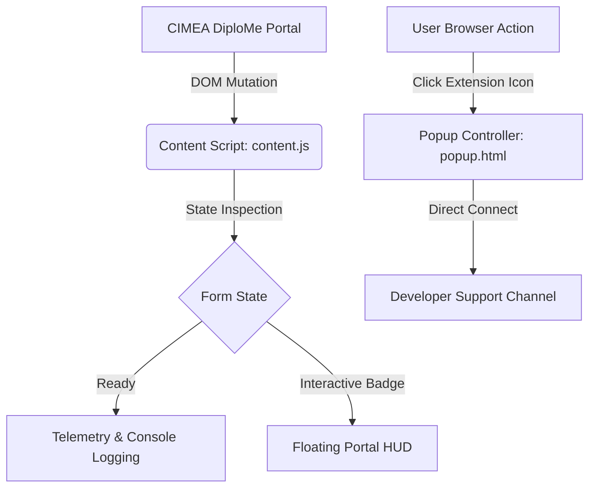

# ⚡ CIMEA Assistant Pro

[](https://developer.chrome.com/docs/extensions/mv3/intro/)
[](https://github.com/ELSOUDY2030/cimea)
[](https://github.com/ELSOUDY2030/cimea)
[](LICENSE)

> **CIMEA Assistant Pro** is an enterprise-grade, lightweight Google Chrome extension tailored for optimizing, monitoring, and streamlining user interactions with the Italian academic equivalency and statement of comparability portal **CIMEA DiploMe** (`mywallet.cimea-diplome.it`).

---

## 📑 Table of Contents

- [Overview](#-overview)
- [Key Features](#-key-features)
- [Architecture & Technical Design](#-architecture--technical-design)
- [Prerequisites & System Requirements](#-prerequisites--system-requirements)
- [Installation Guide](#-installation-guide)
- [Workflow & How It Works](#-workflow--how-it-works)
- [Project Directory Structure](#-project-directory-structure)
- [Developer & Enterprise Support](#-developer--enterprise-support)
- [License](#-license)

---

## 🔍 Overview

Applying for Statement of Comparability and Verification on the CIMEA DiploMe platform involves multi-stage verification forms, tight quota management, and complex wizard steps. **CIMEA Assistant Pro** provides client-side intelligence to help applicants, institutions, and consultants seamlessly interact with the portal, detect application readiness, and verify billing and payment prerequisites without performance overhead.

Built entirely on modern **Google Chrome Manifest V3**, the extension ensures zero latency, complete sandbox security, and full compliance with Content Security Policies (CSP).

---

## 🌟 Key Features

### 1. Smart Portal Workflow Telemetry
* Continuously observes the DOM state across application wizard steps (Qualifications, Services, Billing Address, Payment).
* Detects form completeness and missing mandatory checkboxes before submission.
* Eliminates repetitive operator errors by providing clear, visual status feedback directly in the portal.

### 2. High-Performance Client Execution
* Built with zero external heavyweight dependencies (zero jQuery, zero bloated frameworks).
* Pure Vanilla ES6+ implementation ensuring sub-millisecond execution times.
* Fully decoupled UI thread handling to ensure that page scrolling and interactions remain butter-smooth.

### 3. Non-Intrusive Floating Assistance
* Renders a sleek, dismissed floating HUD widget in the bottom-right corner of CIMEA application pages.
* Displays live operational telemetry, current page state, and instant developer communication channels.

### 4. Interactive Extension Popup
* Clean dark-mode interface built with modern CSS glassmorphism.
* Quick-access buttons for direct communication with the developer via WhatsApp and Email for technical support or custom extensions.

### 5. Strict Security & Privacy
* Operates strictly within the client browser context.
* Zero external data exfiltration, analytics trackers, or third-party cookies.
* Adheres fully to Google Chrome's Manifest V3 security standards.

---

## 🏗 Architecture & Technical Design



### Component Breakdown

| Component | File | Execution Realm | Purpose |
|:---|:---|:---|:---|
| **Manifest** | `manifest.json` | Extension Engine | Declares Manifest V3 permissions, content script matchers, and metadata. |
| **Content Script** | `content.js` | Isolated World | Executes on `cimea-diplome.it` and `cimea.it` to manage in-page telemetry and UI badge. |
| **Popup Interface** | `popup.html` | Extension Action | Dark-mode interactive dashboard displaying extension status and developer contact cards. |

---

## 💻 Prerequisites & System Requirements

- **Supported Browsers:**
  - Google Chrome (v88 or higher recommended)
  - Microsoft Edge (Chromium-based, v88 or higher)
  - Brave Browser, Opera, or Vivaldi
- **Permissions Required:**
  - `storage`: For caching local configuration preferences safely.
- **Host Permissions:**
  - `*://*.cimea-diplome.it/*`
  - `*://*.cimea.it/*`

---

## 🚀 Installation Guide

Installing **CIMEA Assistant Pro** takes less than 60 seconds:

### Step 1: Clone or Download the Repository
Clone the repository using Git:
```bash
git clone https://github.com/ELSOUDY2030/cimea.git
```
*Alternatively, download the ZIP archive from GitHub and extract it to a local folder.*

### Step 2: Open Extensions in Google Chrome
1. Launch Google Chrome.
2. In the URL address bar, enter:
   ```text
   chrome://extensions/
   ```
3. Press **Enter**.

### Step 3: Enable Developer Mode
Look at the top-right corner of the Extensions page and toggle the **Developer mode** switch to **ON**.

### Step 4: Load Unpacked Extension
1. Click the **Load unpacked** button in the top-left toolbar.
2. In the file explorer dialog, select the cloned `cimea` directory.
3. Click **Select Folder**.

### Step 5: Pin the Extension
1. Click the puzzle icon (Extensions menu) next to the Chrome address bar.
2. Find **CIMEA Assistant Pro** and click the **Pin** icon for quick access.

---

## 🔄 Workflow & How It Works

1. **Automatic Initialization:**
   Whenever you navigate to `mywallet.cimea-diplome.it`, the extension initializes automatically in the background.
2. **Console Telemetry:**
   Open Chrome DevTools (`F12` or `Ctrl+Shift+I`) to observe real-time diagnostic output:
   ```text
   ======================================================
     🚀 CIMEA Assistant Pro v1.0.0
     Automated Portal Helper & Workflow Assistant
   ------------------------------------------------------
     👤 Developer: Mohammad Nomer
     📞 Phone:     01144413637 (+20 114 441 3637)
     ✉️ Email:     mohammadnomer2030@gmail.com
   ======================================================
   ```
3. **In-Page Floating Assistant:**
   A non-intrusive floating badge will appear at the lower-right of the screen, confirming active monitoring. You can dismiss it at any time by clicking `✕`.
4. **Popup Controller:**
   Click the extension icon in your Chrome toolbar to open the control panel, check extension health, or reach out to developer support.

---

## 📂 Project Directory Structure

```text
cimea/
├── LICENSE             # MIT Open Source License
├── README.md           # Comprehensive Technical Documentation
├── manifest.json       # Chrome Extension Manifest V3 configuration
├── content.js          # In-page DOM observer and telemetry injector
└── popup.html          # Interactive dark-mode toolbar controller
```

---

## 👨‍💻 Developer & Enterprise Support

**CIMEA Assistant Pro** is designed and maintained by **Mohammad Nomer**, an automation engineer specializing in complex portal integration, high-concurrency event handling, and custom browser automation tools.

### Contact Information

For commercial inquiries, specialized workflow bots, or technical consulting:

| Channel | Contact Details | Direct Link |
|:---|:---|:---|
| **Developer** | Mohammad Nomer | [GitHub Profile](https://github.com/ELSOUDY2030) |
| **Phone** | `01144413637` | [`tel:01144413637`](tel:01144413637) |
| **International** | `+20 114 441 3637` | [`tel:+201144413637`](tel:+201144413637) |
| **WhatsApp** | `+20 114 441 3637` | [Chat on WhatsApp](https://wa.me/201144413637) |
| **Email** | `mohammadnomer2030@gmail.com` | [Send Email](mailto:mohammadnomer2030@gmail.com) |

---

## 📄 License

This project is licensed under the **MIT License**. See the [LICENSE](LICENSE) file for complete terms and copyright notices.
